# 🧬 BioNova – Biotechnology Quiz & Learning Platform

BioNova is a full-stack biotechnology learning and assessment platform designed to help students learn, test, and strengthen their biotechnology knowledge through interactive quizzes, progress tracking, gamification, analytics, leaderboards, achievements, and certificates.

The platform provides separate **Student** and **Admin** experiences with secure authentication, role-based authorization, quiz management, detailed performance tracking, and a modern biotechnology-focused interface.

---

## 🌐 Live Application

### Primary Frontend – Vercel

https://quiz-management-platform-drab.vercel.app

### Alternative Frontend – Render

https://quiz-management-frontend-tbmj.onrender.com

### Backend API

https://quiz-management-api-3kef.onrender.com/api

### API Health Check

https://quiz-management-api-3kef.onrender.com/api/health

---

## ✨ Key Features

### 👩‍🎓 Student Features

- Student registration and login
- Secure JWT-based authentication
- Personalized BioNova onboarding
- Student profile setup
- Biotechnology-focused dashboard
- Browse available quizzes
- Browse quizzes by biotechnology category
- View quiz details before attempting
- Timed quiz attempts
- Question-by-question navigation
- Automatic answer saving
- Multiple quiz attempts
- Automatic submission when time expires
- Instant score calculation
- Pass/fail result calculation
- Detailed result page
- Review correct and incorrect answers
- Question explanations
- Complete attempt history
- Progress analytics
- Category-wise performance tracking
- XP-based progression system
- Student levels
- Daily learning streaks
- Achievements
- Leaderboard rankings
- Certificates
- Notifications
- Student profile management

---

## 🛡️ Admin Features

- Secure admin login
- Role-based admin authorization
- Admin dashboard
- Category management
- Create biotechnology categories
- Edit categories
- Delete categories
- Quiz management
- Create quizzes
- Edit quizzes
- Delete quizzes
- Publish and unpublish quizzes
- Question management
- Add questions to quizzes
- Edit existing questions
- Delete questions
- Manage answer options
- Configure correct answers
- Student management
- View registered students
- Quiz statistics
- Student performance statistics
- Attempt analytics
- Pass/fail analytics
- Administrative performance insights

---

## 🧪 Biotechnology Learning Areas

BioNova is designed to support quizzes across biotechnology subjects such as:

- Cell Biology
- Molecular Biology
- Genetics
- Microbiology
- Biochemistry
- Immunology
- Bioinformatics
- Recombinant DNA Technology
- Industrial Biotechnology
- Pharmaceutical Biotechnology
- Plant Biotechnology
- Omics Technology
- Bioprocess Engineering
- Molecular Diagnostics

---

## 💻 Tech Stack

### Frontend

- React
- Vite
- React Router
- Tailwind CSS
- Axios
- Recharts
- React Hot Toast
- Lucide React

### Backend

- Node.js
- Express.js
- PostgreSQL
- JWT Authentication
- bcrypt
- Express Validator
- Helmet
- CORS
- Express Rate Limit
- Multer
- Nodemailer

### Database

- PostgreSQL

### Deployment & DevOps

- Vercel – Primary Frontend Deployment
- Render Static Site – Alternative Frontend Deployment
- Render Web Service – Backend API
- Render PostgreSQL – Production Database
- GitHub – Source Control
- GitHub + Vercel – Automatic Frontend Deployment
- GitHub + Render – Automatic Backend Deployment

---

## 🏗️ Production Architecture

```text
                         GitHub
                           │
                 ┌─────────┴─────────┐
                 │                   │
                 ▼                   ▼
              Vercel              Render
         Primary Frontend      Backend Web Service
          React + Vite          Node.js + Express
                 │                   │
                 │   HTTPS / REST    │
                 └─────────►─────────┘
                                     │
                                     │ PostgreSQL
                                     ▼
                              Render PostgreSQL
                              Production Database

Alternative Frontend:
Render Static Site ──────────► Render Backend API
```

The primary Vercel frontend and alternative Render frontend communicate with the same Render-hosted backend API and production PostgreSQL database.

---

## 🗂️ Project Structure

```text
Quiz-Management-Platform/
│
├── client/
│   ├── public/
│   │
│   ├── src/
│   │   ├── api/
│   │   ├── components/
│   │   │   └── ui/
│   │   ├── context/
│   │   ├── hooks/
│   │   ├── layouts/
│   │   ├── pages/
│   │   │   ├── admin/
│   │   │   ├── auth/
│   │   │   ├── public/
│   │   │   └── student/
│   │   ├── routes/
│   │   └── App.jsx
│   │
│   ├── package.json
│   └── vite.config.js
│
├── server/
│   ├── src/
│   │   ├── config/
│   │   ├── controllers/
│   │   ├── database/
│   │   ├── middleware/
│   │   ├── routes/
│   │   ├── services/
│   │   ├── app.js
│   │   └── server.js
│   │
│   ├── uploads/
│   ├── package.json
│   └── .env.example
│
├── docs/
│   └── screenshots/
│
├── .gitignore
└── README.md
```

---

## 🗄️ Database

BioNova uses **PostgreSQL** for persistent application data.

The database stores information related to:

- Users
- Student profiles
- Categories
- Quizzes
- Questions
- Answer options
- Quiz attempts
- Student answers
- Progress
- XP
- Levels
- Learning streaks
- Achievements
- Leaderboard data
- Certificates
- Notifications

The production PostgreSQL database is hosted on **Render** and accessed securely by the backend through environment variables.

---

# ⚙️ Local Development Setup

## 1. Clone the Repository

```bash
git clone https://github.com/aabha4747-art/Quiz-Management-Platform.git
```

Move into the project:

```bash
cd Quiz-Management-Platform
```

---

## 🖥️ 2. Backend Setup

Move into the server directory:

```bash
cd server
```

Install dependencies:

```bash
npm install
```

Create a `.env` file inside the `server` directory.

Example:

```env
PORT=5000
NODE_ENV=development

DB_HOST=localhost
DB_PORT=5432
DB_NAME=quiz_platform
DB_USER=postgres
DB_PASSWORD=your_postgres_password

ADMIN_NAME=Platform Admin
ADMIN_EMAIL=admin@example.com
ADMIN_PASSWORD=your_secure_admin_password

EMAIL_USER=your_email@gmail.com
EMAIL_APP_PASSWORD=your_email_app_password

JWT_SECRET=replace_with_a_long_random_secret
JWT_EXPIRES_IN=1d

PASSWORD_RESET_EXPIRES_MINUTES=15

CLIENT_URL=http://localhost:5173
```

> ⚠️ Never commit your real `.env` file, database password, email App Password, JWT secret, or admin password to GitHub.

Start the backend development server:

```bash
npm run dev
```

The backend should run locally at:

```text
http://localhost:5000
```

---

## 🎨 3. Frontend Setup

Open another terminal and move into the client directory:

```bash
cd client
```

Install dependencies:

```bash
npm install
```

Start the frontend:

```bash
npm run dev
```

The frontend should run locally at:

```text
http://localhost:5173
```

---

## 🌐 Environment Variables

### Backend Environment Variables

```text
PORT
NODE_ENV

DB_HOST
DB_PORT
DB_NAME
DB_USER
DB_PASSWORD

ADMIN_NAME
ADMIN_EMAIL
ADMIN_PASSWORD

EMAIL_USER
EMAIL_APP_PASSWORD

JWT_SECRET
JWT_EXPIRES_IN

PASSWORD_RESET_EXPIRES_MINUTES

CLIENT_URL
```

### Frontend Environment Variable

```text
VITE_API_URL
```

For production:

```env
VITE_API_URL=https://quiz-management-api-3kef.onrender.com/api
```

No production passwords, database credentials, JWT secrets, or email credentials should be committed to the repository.

---

# 🚀 Production Deployment

BioNova uses a multi-service production deployment architecture:

- **Vercel** hosts the primary React/Vite frontend.
- **Render Static Site** hosts an alternative frontend deployment.
- **Render Web Service** hosts the Node.js/Express backend.
- **Render PostgreSQL** stores production application data.

---

## ▲ Primary Frontend – Vercel

Production URL:

```text
https://quiz-management-platform-drab.vercel.app
```

### Configuration

```text
Root Directory: client
Framework Preset: Vite
Build Command: npm run build
Output Directory: dist
```

### Environment Variable

```text
VITE_API_URL=https://quiz-management-api-3kef.onrender.com/api
```

Vercel is connected to the GitHub repository so frontend changes can be automatically deployed from the repository.

---

## 🌐 Alternative Frontend – Render Static Site

Production URL:

```text
https://quiz-management-frontend-tbmj.onrender.com
```

### Configuration

```text
Root Directory: client
Build Command: npm install && npm run build
Publish Directory: dist
```

### Environment Variable

```text
VITE_API_URL=https://quiz-management-api-3kef.onrender.com/api
```

---

## ⚙️ Backend – Render Web Service

Backend API:

```text
https://quiz-management-api-3kef.onrender.com/api
```

### Configuration

```text
Root Directory: server
Build Command: npm install
Start Command: npm start
```

Production backend environment variables are configured securely through the Render dashboard.

The backend CORS configuration allows requests from the approved production frontend origins.

---

## 🗄️ Database – Render PostgreSQL

The production application uses a Render-hosted PostgreSQL database.

The backend connects to the production PostgreSQL instance using environment variables rather than hard-coded credentials.

Production data includes users, quizzes, questions, attempts, answers, student profiles, achievements, certificates, and other application data.

---

## 🔄 Deployment Flow

```text
Developer
   │
   ▼
GitHub Repository
   │
   ├──────────────► Vercel
   │                │
   │                └── Primary React/Vite Frontend
   │
   └──────────────► Render
                    │
                    ├── Alternative Frontend
                    ├── Express Backend API
                    └── PostgreSQL Database
```

---

## 🔒 Security

BioNova implements several security practices, including:

- Password hashing
- JWT authentication
- Role-based authorization
- Protected API routes
- Input validation
- Rate limiting
- Helmet security headers
- CORS configuration
- Environment-variable-based secret management
- `.env` protection through `.gitignore`
- Authentication middleware
- Authorization middleware
- Production credential rotation when required

Sensitive credentials are **not stored directly in the source code**.

Database passwords, JWT secrets, email credentials, and administrative credentials are managed using environment variables.

---

## ❤️ API Health Check

The backend provides health-check endpoints to verify deployment.

### API Status

```http
GET /api/health
```

Example response:

```json
{
  "success": true,
  "message": "Quiz Platform API is running"
}
```

### PostgreSQL Status

```http
GET /api/health/database
```

A successful response confirms that the backend can communicate with the production PostgreSQL database.

---

# ✅ Functionality Tested

The production application has been tested successfully across the deployed environment.

## Authentication

- Registration
- Student login
- Admin login
- Logout
- Authentication persistence
- Protected routes
- Role-based authorization

## Student

- Student onboarding
- Dashboard
- Browse quizzes
- Quiz details
- Start quiz
- Answer questions
- Submit quiz
- Result calculation
- Result review
- Attempt history
- Progress analytics
- XP
- Levels
- Learning streaks
- Leaderboard
- Achievements
- Certificates

## Admin

- Admin authentication
- Admin dashboard
- Category management
- Quiz management
- Question management
- Student management
- Analytics

## Production Infrastructure

- Vercel frontend deployment
- Render frontend deployment
- Render backend deployment
- PostgreSQL production connection
- Vercel-to-Render API communication
- Render-frontend-to-Render-API communication
- Production authentication
- Production quiz retrieval
- Production quiz submission
- Production database reads
- Production database writes
- Attempt persistence
- Progress retrieval
- Leaderboard retrieval
- Certificate functionality

---

# 📸 Screenshots

## Home Page

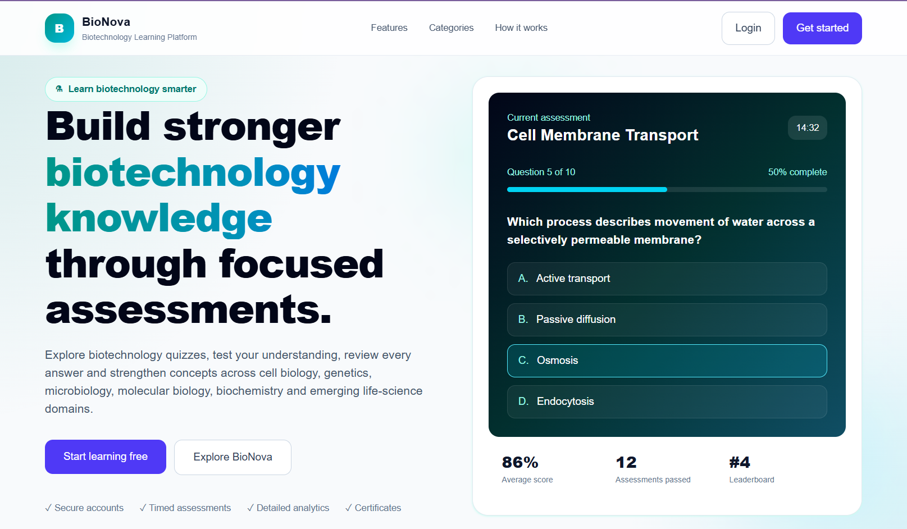

## Login

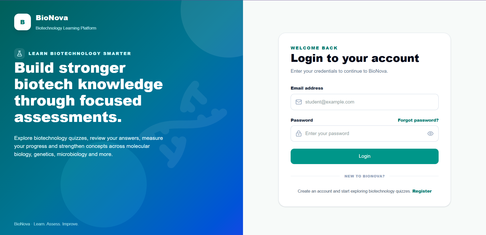

## Register

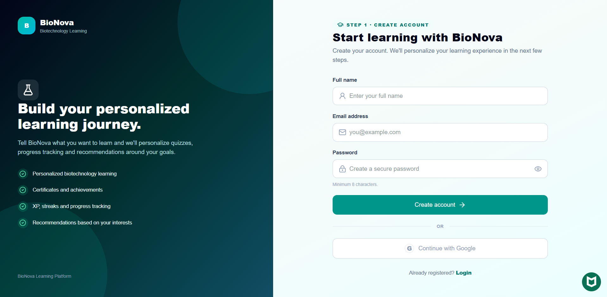

## Student Dashboard

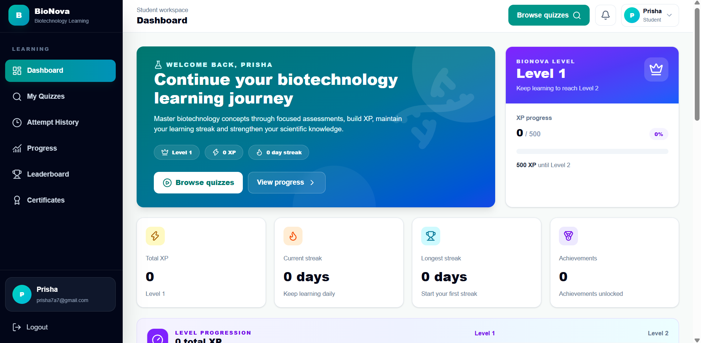

## Quiz Library

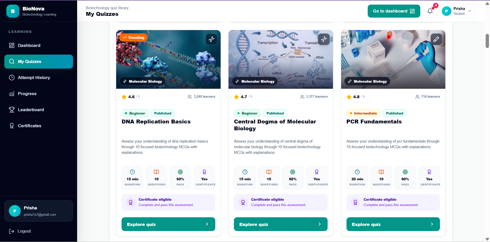

## Quiz Attempt

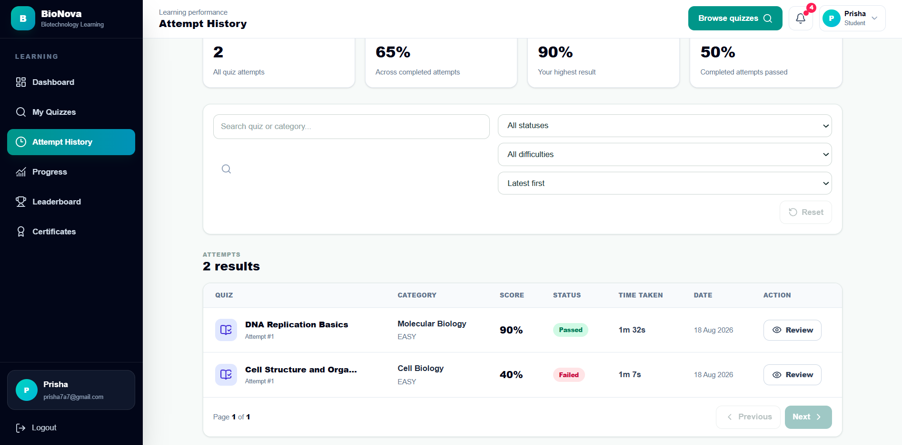

## Quiz Result

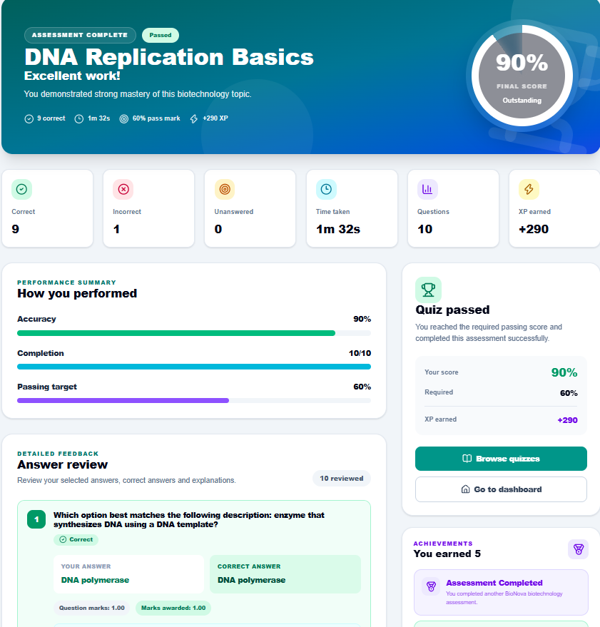

## Progress Analytics

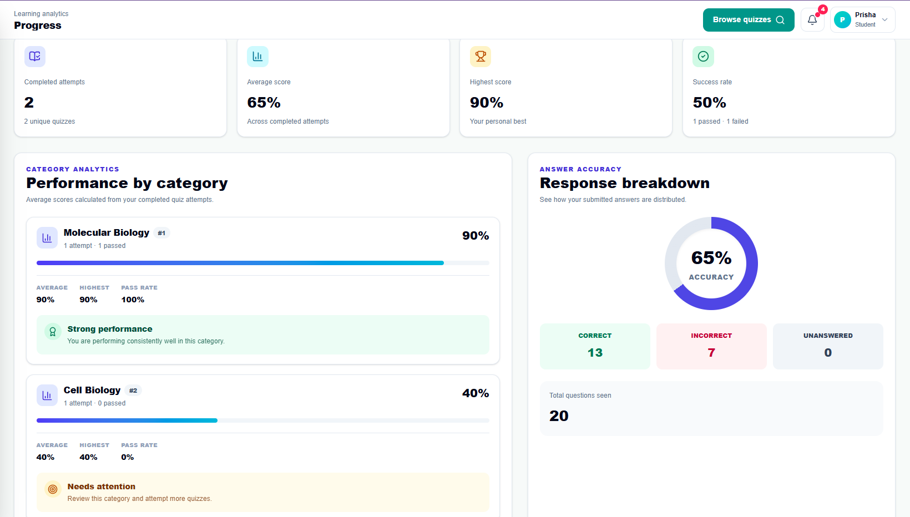

## Leaderboard

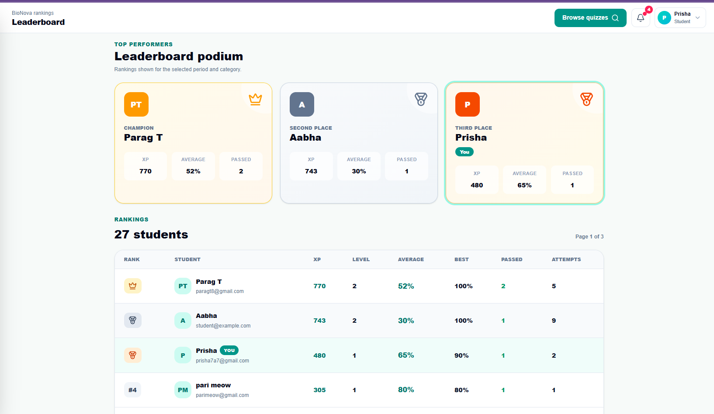

## Certificate

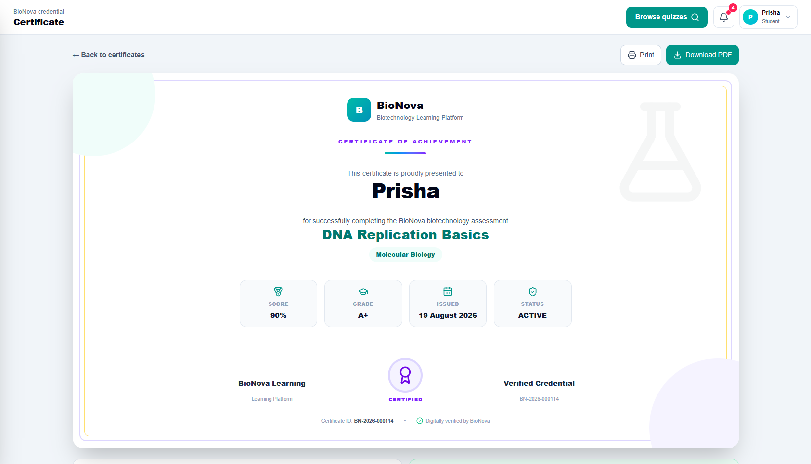

## Admin Dashboard

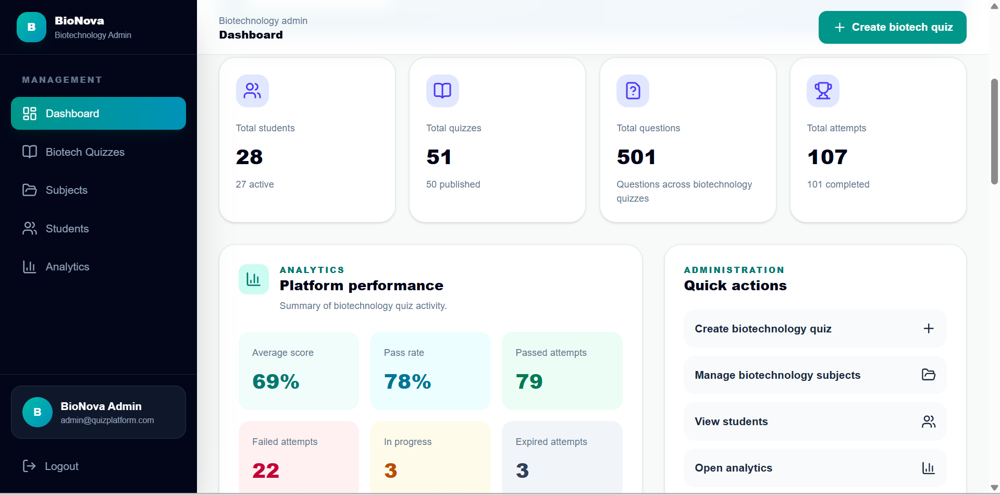

## Admin Quiz Management

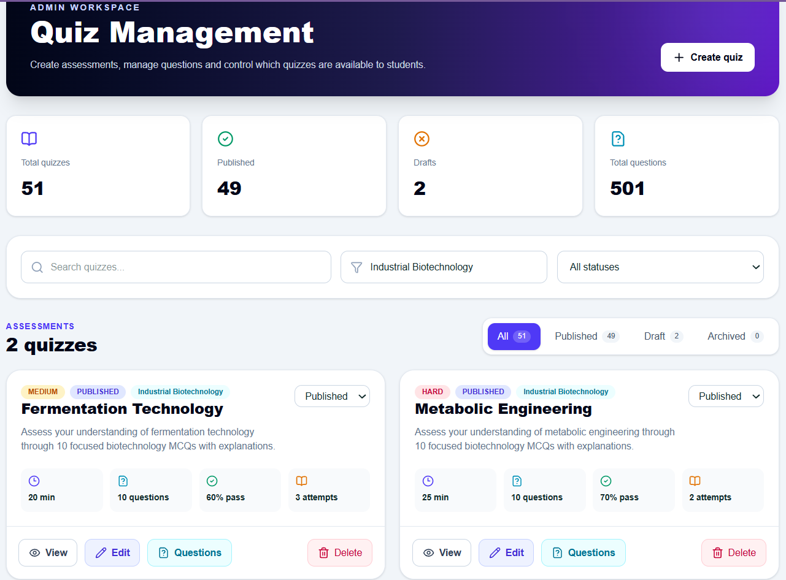

## Admin Category Management

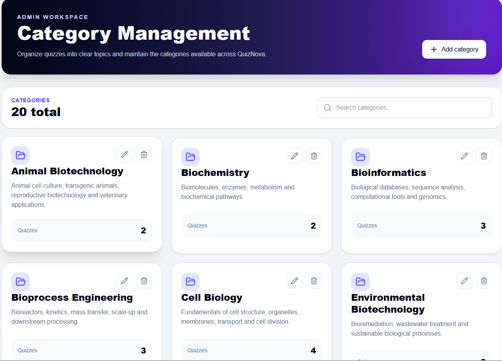

## Admin Students

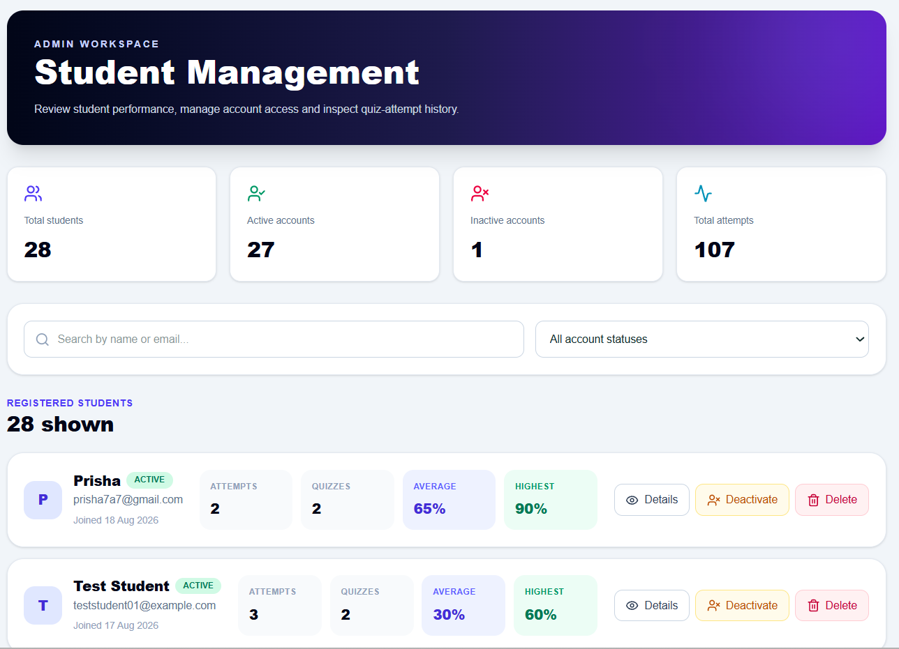

## Admin Analytics

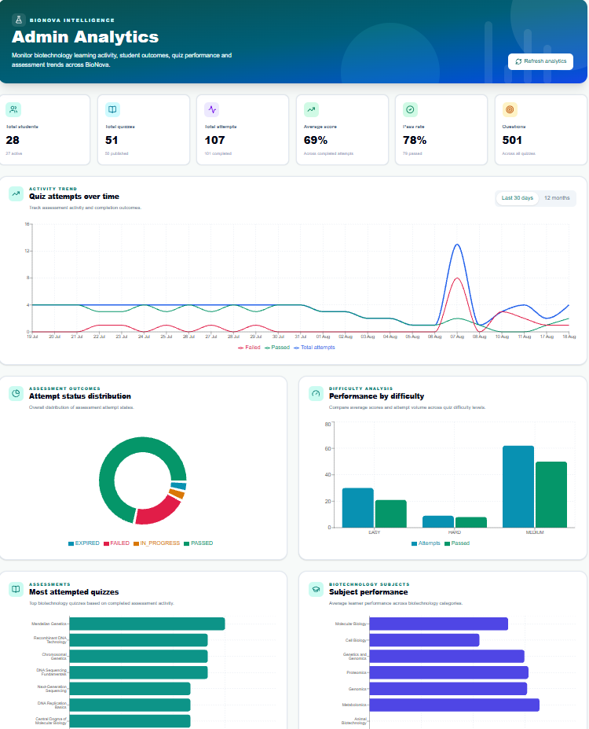

---

# 🔮 Future Enhancements

Future versions of BioNova could include:

- AI-generated biotechnology quizzes
- Adaptive quiz difficulty
- Personalized learning recommendations
- AI-powered explanations
- AI biotechnology tutor
- Personalized learning paths
- Advanced student analytics
- Question randomization
- Larger biotechnology question bank
- Course modules
- Study materials
- Flashcards
- Google authentication
- Cloud-based image storage
- Advanced certificate customization
- Mobile application
- Improved mobile responsiveness

---

# 🎯 Project Objective

The objective of BioNova is to create an engaging digital learning environment where biotechnology students can:

- Test their knowledge
- Identify weak concepts
- Track their learning progress
- Practice biotechnology topics
- Improve through repeated assessments
- Stay motivated using gamification
- Receive measurable evidence of progress

The administrative system enables educators or platform administrators to manage learning content and monitor student performance.

The project also demonstrates the development and deployment of a complete full-stack application using a modern React frontend, REST API architecture, PostgreSQL persistence, authentication, authorization, cloud deployment, and production environment configuration.

---

# 📌 Project Status

**Status: Fully Functional & Deployed**

The current production system successfully supports:

- Student authentication
- Admin authentication
- Student onboarding
- Biotechnology quizzes
- Quiz attempts
- Result calculation
- Attempt history
- Progress analytics
- XP and levels
- Learning streaks
- Leaderboards
- Achievements
- Certificates
- Admin content management
- Admin analytics
- PostgreSQL persistence
- Vercel frontend deployment
- Render frontend deployment
- Render backend deployment
- Production database connectivity
- Cross-origin frontend-to-backend communication

### Production Deployment Status

| Component | Platform | Status |
|---|---|---|
| Primary Frontend | Vercel | ✅ Live |
| Alternative Frontend | Render | ✅ Live |
| Backend API | Render | ✅ Live |
| PostgreSQL Database | Render | ✅ Connected |
| Source Control | GitHub | ✅ Active |

---

# 👩‍💻 Author

**Aabha Tembhurne**

B.E. Biotechnology  
RV College of Engineering

---

# 📄 License

This project was developed for educational and academic purposes.